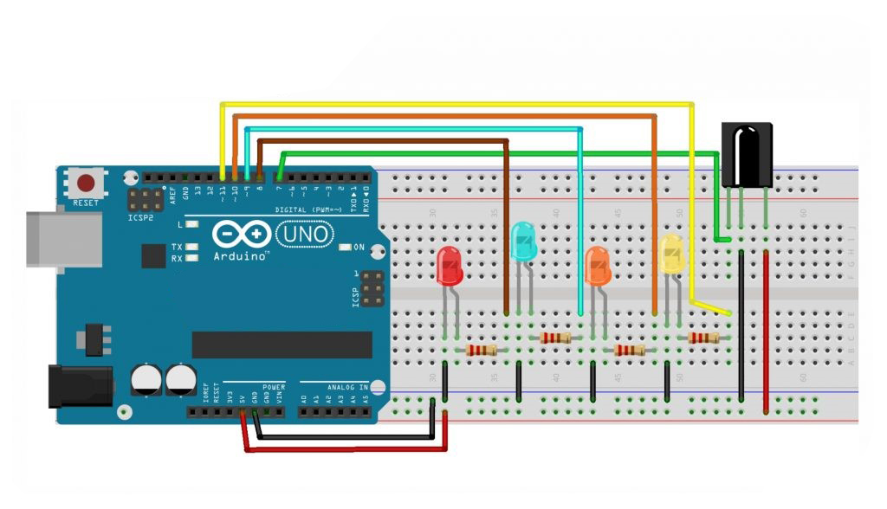
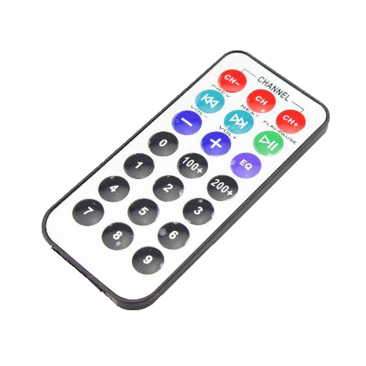
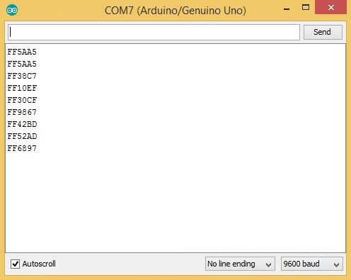

# IR Remote Control Program

- Infrared is a widely used and easy to implement wireless technology that has many useful applications. The most prominent example in everyday life is the TV remote control. Infrared radiation is a form of light that is similar to the light we see around us. The only difference between IR light and visible light is their frequency and wavelength. Infrared frequencies and wavelengths are beyond the range of visible light.

- Infrared communication systems require an IR transmitter and an IR receiver. To prevent noise from interfering with the IR signal, signal modulation techniques are used. In IR signal modulation, the encoder on the IR remote converts the binary signal into a modulated electrical signal. In IR signal modulation, the encoder on the IR remote converts the binary signal into a modulated electrical signal. This electrical signal is sent to the transmitting LED. The IR receiver then demodulates the IR light signal and converts it back to binary before passing the information to the microcontroller.

## Features

- Controls four LEDs using an IR remote control.
- Each button press on the remote corresponds to a specific LED.
- Simple integration using the `IRremote` library.

# Schematic:

- Below you can see a schematic image to facilitate the wiring of cables from the microcontroller to devices, both input and output sensors:



## Components (Tools & Materials):

- Arduino Uno = 1 unit; <br/>
- IR Receiver (TSOP38238) = 1 unit; <br/>
- IR Remote = 1 unit; <br/>
- The following is a picture of the IR Remote used: <br/>
   <br/>
- Red LED = 1 unit; <br/>
- Blue LED = 1 unit; <br/>
- Green LED = 1 unit;<br/>
- Yellow LED = 1 unit;<br/>
- 220Ω resistors = 4 units (for current limiting);<br/>
- Breadboard / Project Board = 1 unit;<br/>
- Jumper wires.<br/>

## Pin Configuration

- **IR Receiver**:
  - VCC → 5V Arduino
  - GND → GND Arduino
  - Signal → Pin 7 Arduino
- **LED Connections**:
  - Red LED → Pin 8 Arduino
  - Blue LED → Pin 9 Arduino
  - Orange LED → Pin 10 Arduino
  - Yellow LED → Pin 11 Arduino
  - Connect the other ends of the LEDs to ground through resistors.

## How It Works

1. **IR Signal Reception**: The IR receiver captures the signals from the remote control and sends them to the Arduino.
2. **LED Control**: The Arduino interprets the signal based on the button pressed and lights up the corresponding LED for 2 seconds:
   - Button "1" lights the Red LED.
   - Button "2" lights the Blue LED.
   - Button "3" lights the Orange LED.
   - Button "4" lights the Yellow LED.

## Code Explanation

## a. Program Inisialisasi kode

    ```cpp
    /*
    Program Scan Kode IR
    */
    #include <IRremote.h>

    const int RECV_PIN = 7;
    IRrecv irrecv(RECV_PIN);
    decode_results results;

    void setup() { //Pengaturan Pin
    Serial.begin(9600);
    irrecv.enableIRIn();
    irrecv.blink13(true);
    }

    void loop() { //Perulangan Program
    if (irrecv.decode(&results)) { //Pencarian Kode IR
        Serial.println(results.value, HEX); //Penampilan Kode IR
        irrecv.resume();
    }
    }
    ```

- Run the program above, then open the serial terminal, then press each button on the remote. <br/><br/>
  
- Image to Terminal Serial <br/>

## Table of Remote Keys and Hexadecimal Codes (\*)

## IR Remote Control Button Codes

This section provides a reference for the button codes of the IR remote control used in this project. Each button on the remote corresponds to a unique hexadecimal code. These codes are captured by the IR receiver and used to control actions such as turning LEDs on or off.

## Remote Button and Hexadecimal Codes (\*)

<br/>
-----------------------------<br/>
| Button | Hexadecimal Code |<br/>
| ------ | -----------------|<br/>
| CH-    | 0xFFA25D         |<br/>
| CH     | 0xFF629D         |<br/>
| CH+    | 0xFFE21D         |<br/>
| <<     | 0xFF22DD         |<br/>
| >>     | 0xFF02FD         |<br/>
| >||    | 0xFFC23D         |<br/>
| –      | 0xFFE01F         |<br/>
| +      | 0xFFA857         |<br/>
| EQ     | 0xFF906F         |<br/>
| 100+   | 0xFF9867         |<br/>
| 200+   | 0xFFB04F         |<br/>
| 0      | 0xFF6897         |<br/>
| 1      | 0xFF30CF         |<br/>
| 2      | 0xFF18E7         |<br/>
| 3      | 0xFF7A85         |<br/>
| 4      | 0xFF10EF         |<br/>
| 5      | 0xFF38C7         |<br/>
| 6      | 0xFF5AA5         |<br/>
| 7      | 0xFF42BD         |<br/>
| 8      | 0xFF4AB5         |<br/>
| 9      | 0xFF52AD         |<br/>
-----------------------------<br/>
<br/>
## How to Use

- These codes are captured by the IR receiver when a corresponding button is pressed on the remote.
- Use the hexadecimal codes in your Arduino code to perform specific actions when certain buttons are pressed.

## Example Usage

In your Arduino program, you can use the codes to trigger different functions. Here's an example for the button "1":

```cpp
if (results.value == 0xFF30CF) {
  // Action when button "1" is pressed
  digitalWrite(ledPin, HIGH);
}
```

## b. Program Kontrol Menyalakan (Menghidupkan) LED

```cpp
#include <IRremote.h>

const int RECV_PIN = 7;
IRrecv irrecv(RECV_PIN);
decode_results results;
const int redPin = 8;
const int bluePin = 9;
const int orangePin = 10;
const int yellowPin = 11;

void setup() {
    irrecv.enableIRIn();  // Start the IR receiver
    irrecv.blink13(true); // Blink pin 13 when receiving
    pinMode(redPin, OUTPUT);
    pinMode(bluePin, OUTPUT);
    pinMode(orangePin, OUTPUT);
    pinMode(yellowPin, OUTPUT);
}

void loop() {
  if (irrecv.decode(&results)) {  // Check for IR input
    switch (results.value) {
      case 0xFF30CF:  // Keypad button "1"
        digitalWrite(redPin, HIGH);
        delay(2000);
        digitalWrite(redPin, LOW);
        break;
      case 0xFF18E7:  // Keypad button "2"
        digitalWrite(bluePin, HIGH);
        delay(2000);
        digitalWrite(bluePin, LOW);
        break;
      case 0xFF7A85:  // Keypad button "3"
        digitalWrite(orangePin, HIGH);
        delay(2000);
        digitalWrite(orangePin, LOW);
        break;
      case 0xFF10EF:  // Keypad button "4"
        digitalWrite(yellowPin, HIGH);
        delay(2000);
        digitalWrite(yellowPin, LOW);
        break;
    }
    irrecv.resume();  // Receive the next value
  }
}
```

• The IRremote library is used to receive and decode signals from the remote.
• Each button press triggers a corresponding case in the switch statement, turning on the appropriate LED for 2 seconds.
• The irrecv.resume() function allows the program to continuously receive IR signals.

## Usage:

1. Connect the components as per the pin configuration. <br/>
2. Upload the code to your Arduino Uno. <br/>
3. Use the remote control to turn on and off the LEDs: <br/>
   - o Button "1" turns on the red LED. <br/>
   - o Button "2" turns on the blue LED. <br/>
   - o Button "3" turns on the orange LED. <br/>
   - o Button "4" turns on the yellow LED. <br/>

## Conclusion

- This project demonstrates how to control multiple LEDs with an IR remote using an Arduino. It’s an excellent foundation for remote-controlled projects, such as turning devices on and off with ease.

- In this project, the IR sensor receives the beam from the IR remote then demodulates the signal and converts it back to binary and passes it to the Arduino to carry out a command such as turning on the LED on each button that has been programmed.
  <br/>
  "# Remote-Control-Infrared"
